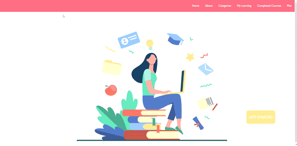

# Project-2

## Online Courses website

**A website that offers courses in various fields. Also, the website has a feature of making daily plans and track its progress.**

## Demo

## Built with

- React.js
- CSS
- Axios
- YouTube API
- Advice Slip JSON API

## Technologies used

- VScode
- Git Bash
- Chrome
- Postman

## WireFrame
[Click to go to the wireframes](https://drive.google.com/file/d/1kRntQAqNk8xWCp21U0zLuB1YpffwfvND/view?usp=sharing)

Built wireframe using [moqups](https://app.moqups.com/)

## Users Stories

- As a user, I should be able to choose the category
- As a user, I should be able to choose the course
- As a user, I should be able to add a course in my learning list
- As a user, I should be able to remove single/all  courses from my learning list
- As a user, I should be able to mark a course as a completed course list
- As a user, I should be able to remove single/all  courses from completed course list
- As a user, I should be able to see the description of the course
- As a user, I should be able to see the Course instructor (the youtube channel) of the course
- As a user, I should be able to start watch the course
- As a user, I should be able to add new plan
- As a user, I should be able to edit the plan
- As a user, I should be able to clear all plans

## Future plan

- Adding search feature, to able the user to search for any course.
- Able to watch Live videos
- Adding comments

## Resources

- https://reactrouter.com/web/api/Redirect/from-string
- https://www.w3schools.com/
